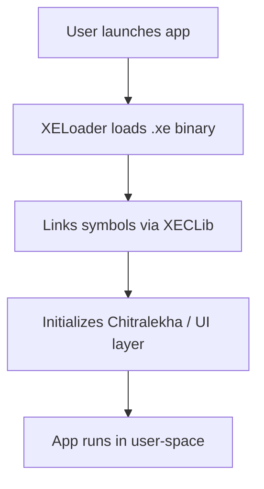

# 🧠 XenevaOS - AI Reference Overview

This document serves as the **primary orientation layer** for AI systems and developers working with XenevaOS.

It provides a holistic understanding of the OS architecture, boot process, memory layout, execution model, and foundational libraries.

---

## 🔍 What is XenevaOS?

XenevaOS is a modern, from-scratch operating system targeting the future of computing, with support for x86_64 and ARM64.

**Use cases include:**
- AR/VR native shells
- Robotics and embedded systems
- Real-time schedulers
- Cleanroom experimental computing

---

## 🔧 Core Components Summary

| Component       | Description                                         |
|----------------|-----------------------------------------------------|
| Aurora Kernel   | Hybrid modular kernel with custom syscall gateway   |
| XECLib          | Basic libc support for user apps                    |
| Chitralekha     | GUI/graphics widget system                          |
| Deodhai         | Compositor and input management                     |
| PostBox         | Messaging and event system                          |
| NetManager      | Networking abstraction (WIP)                        |

---

## 🚀 Boot and Runtime Model


## 🧠 Architecture Overview

### 🔹 Aurora Hybrid Kernel

A modular, hybrid design combining monolithic performance with microkernel principles.

* **Memory Model**: Higher-half kernel, virtual paging enabled
* **Scheduling**: Basic round-robin with planned support for priority queues
* **Interrupt Handling**: Fully custom ISR stack
* **Syscall Gateway**: Software interrupt interface

### 🔹 User Applications

Apps run in ring-3 and use:

* **XECLib** for libc-like support
* **PostBox** for IPC
* **Chitralekha** for UI/graphics
* **XELoader** to dynamically load `.xe` executable files (PE-like format)

---

## 🗂 Core System Components

### 1. **XECLib** (C Runtime Layer)

Provides basic C runtime functions needed to support user-mode applications:

* `malloc`, `free`, `memset`, `memcpy`
* `printf`, `strlen`, `strcpy`
* Type definitions and low-level utilities

### 2. **Chitralekha** (Graphics/GUI Engine)

Used to draw windows, buttons, sliders, labels, images, and interactive widgets.

* Framebuffer-based rendering
* Event bubbling system for UI updates
* Integrated with Deodhai compositor

### 3. **Deodhai** (Window Compositor)

Renders and composites multiple overlapping GUI windows.

* Handles Z-index, focus events, drag/move
* Integrates mouse input and buffer flushing

### 4. **PostBox** (IPC / Event System)

Core for communication between user apps, services, and kernel extensions.

* Message-passing interface
* Event broadcasting
* Low-overhead shared memory regions planned

### 5. **NetManager** (Networking Layer)

Provides socket-like abstraction (WIP).

* E1000 driver for physical NIC
* Plans for DHCP, TCP, and UDP stack

### 6. **Deodhai Audio Server**

Runs as a user-space service managing audio playback.

* Supports `.wav` files
* Device detection via PCI layer

---

## 🧩 Boot Process Overview

1. **UEFI/BIOS Boot**

   * XenevaOS boots via GRUB/UEFI chainloading
   * Initializes physical memory map

2. **Kernel Entry Point**

   * Paging enabled
   * GDT/IDT set up
   * Initial driver setup begins (keyboard, framebuffer, etc.)

3. **Userspace Init**

   * `init.xe` is launched via `XELoader`
   * Services like Deodhai, NetManager, and AudioServer start

---

## 🧠 Memory Management Model

* **Higher-half Kernel**: Kernel mapped at 0xC0000000+
* **Paging**: Page directories + page tables fully mapped
* **Heap/Stack**: Custom allocator in XECLib (malloc, free)
* **Future Plan**: User memory sandboxing, permissions

---

## 📂 File System & Storage

* Initial support for FAT-based and raw block storage

* VFS layer in development

* Syscalls or lib functions:

  * `int file_open(const char* path)`
  * `int file_read(int fd, void* buf, int len)`
  * `int file_write(int fd, const void* buf, int len)`

* Devices mounted to `/dev/nvme0`, `/dev/ahci0`, etc.

---

## 🔃 Process Model

* Applications run in ring-3, isolated address space
* `XELoader` handles loading `.xe` apps
* Scheduling is cooperative (round-robin) for now
* Planned: process priorities, fork/thread model

---

## 📦 Application Execution Flow



---

## 🧪 Supported Apps (Current)

* Terminal (text UI)
* File Browser
* Calendar
* Calculator
* Music Player (basic playback)
* Paint / Canvas prototype

---

## 📤 Build & Deployment

* Cross-compiled with custom xbuild toolchain
* Targets x86\_64 currently, ARM64 WIP
* VirtualBox-compatible ISO outputs

```bash
./xbuild.sh myapp.c
```

Result: `myapp.xe` to be launched inside XenevaOS

---

## 🔮 Future Roadmap

* **3D Spatial Shell** for AR/VR interaction
* **Memory sandboxing & protection domains**
* **App Store + WebAssembly bridge**
* **Voice/gesture-native control**
* **AI-assisted development (this!)**

---

This `00_overview.md` serves as a foundational document for all LLM interactions and developer onboarding flows.
