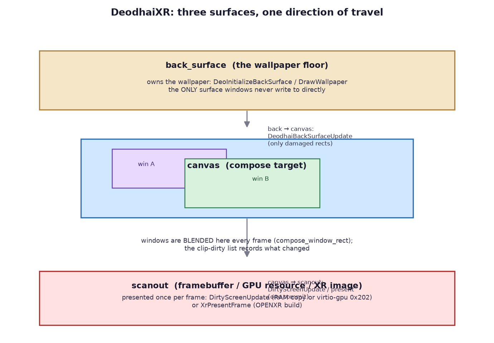
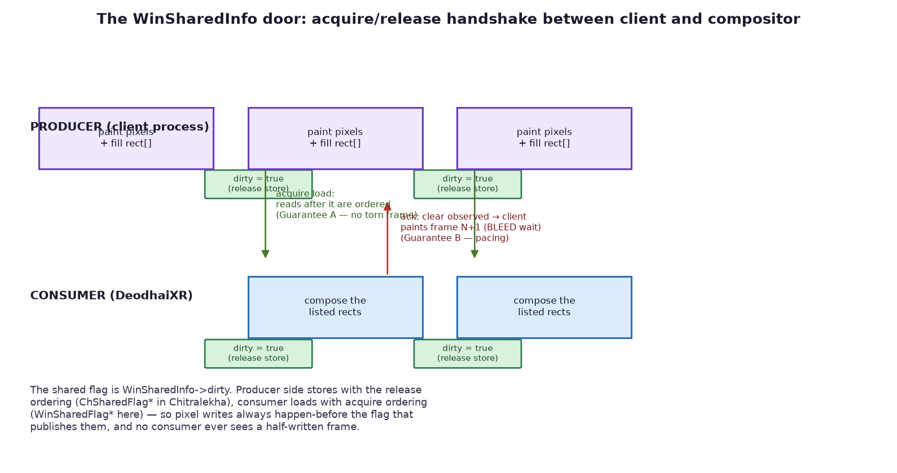
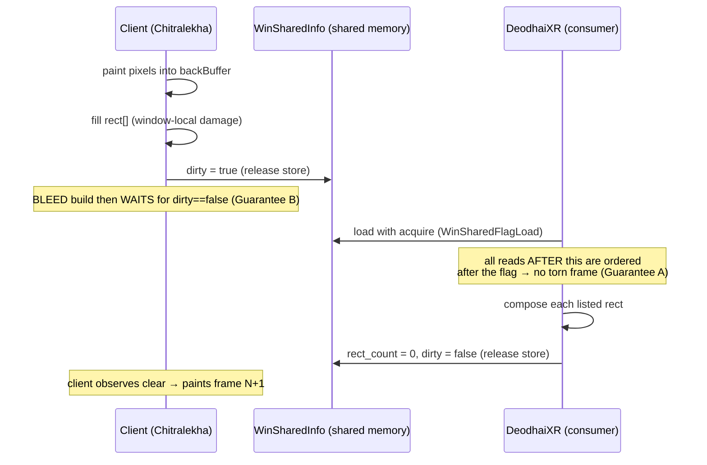
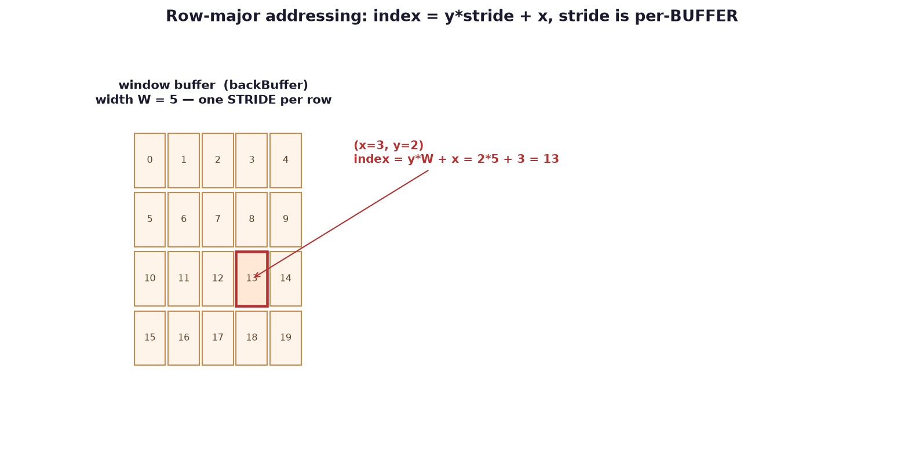
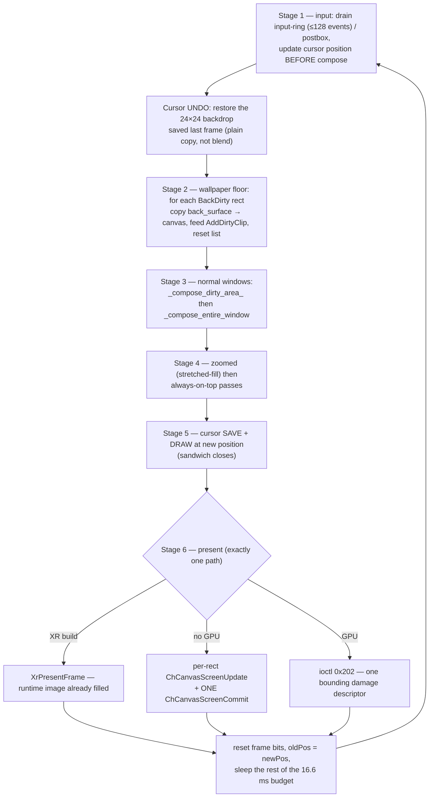
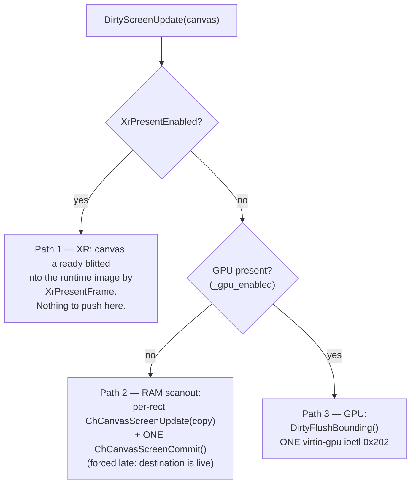

# DeodhaiXR — the compositor & XR shell: a complete study guide

DeodhaiXR is **XenevaOS's window compositor** — the process that owns the
screen, reads input, blends every window onto the display, and (in its XR
build) hands finished frames to OpenXR instead of a monitor. This guide
collects the full anatomy: surfaces, shared memory, the atomic door that
keeps frames coherent, the damage/clip algebra, the per-frame loop, the
three present paths, and the input pipeline — plus worked math examples and
a self-check question bank.

> **Source of truth:** all code references are to `Process/DeodhaiXR/` on the
> `fork` branch (the modern tree, with `xr_present.cpp`/`xr_qemu.cpp`).
> A companion branch, **`study/learning`**, carries the same code with
> `// STUDY:` comment blocks annotating every core function — see
> [Reading the annotated code](#12-reading-the-annotated-code).

---

## 0. The cast — two processes, one shared model

| Role | Process / Library | Direction |
|---|---|---|
| Compositor (owns the screen, composes, routes input) | `Process/DeodhaiXR` | **consumes** window pixels + damage, **produces** input events |
| Client windows (apps, taskbar, launcher) | `Libs/Chitralekha` widgets + apps | **produce** pixels into shared `backBuffer`, **consume** input events |
| Windowing server (the non-XR sibling) | `Process/Deodhai` (`deomain.cpp`) | same door pattern, used for cross-window bookkeeping |
| GPU / display | virtio-gpu (`/dev/virtiogpu`) or RAM scanout | receives one damage **descriptor** per frame |

Everything that crosses a process boundary does so through **shared memory**
(keys derived from `ownerId`) and the **postbox** (a kernel event ring for
messages and input). There is no per-frame syscall to paint a window — the
client writes pixels and flips a shared flag.

**Core files (the scope of this guide):**

```
Process/DeodhaiXR/
├── main.cpp      frame loop, window lifecycle, input routing, dispatch
├── compose.cpp   the compose passes + compose_window_rect (the leaf)
├── dirty.cpp     present-stage damage list (AddDirtyClip, 3 present paths)
├── backdirty.cpp wallpaper-floor damage list (BackDirty*)
├── window.cpp    shared-memory factories, shadow generation, CreateWindow
├── clip.cpp      rectangle occlusion math (fragmenter / intersection)
├── rect.cpp      edge setters/getters that keep the far edge anchored
├── alpha.cpp     blends, box blurs, glass precompute, shadow compose
├── window.h      WINDOW_FLAG_*, WinSharedInfo (THE DOOR), atomics, Window
└── deodxr.h      message/reply/broadcast constants, Rect, AuInputMessage
```

Out of scope (build/XR runtime): `Makefile`, `linker.ld`, `*.s`,
`xr_present.cpp`/`xr_qemu.cpp` internals, and the XR runtime glue.

---

## 1. Surfaces: backSurface → canvas → scanout



```
        ┌───────────────────────────────────────────────┐
        │  back_surface   (the wallpaper floor)         │  written ONCE at boot,
        │  owns the decoded wallpaper                   │  consumed every frame
        └──────────────────────┬────────────────────────┘
                               │  DeodhaiBackSurfaceUpdate(canvas, x,y,w,h)
                               │  copies only the DAMAGED regions
                               ▼
        ┌───────────────────────────────────────────────┐
        │  canvas          (the compose target)         │  windows are blended
        │  buffer[y*canvasW + x]                        │  here each frame
        └──────────────────────┬────────────────────────┘
                               │  DirtyScreenUpdate()  /  XrPresentFrame()
                               │  (ONE commit per frame, one of 3 paths)
                               ▼
        ┌───────────────────────────────────────────────┐
        │  scanout         (framebuffer / GPU resource  │  what the display
        │                   / OpenXR swapchain image)   │  actually shows
        └───────────────────────────────────────────────┘
```

### The back-surface contract: write-once, consume-per-frame

* The wallpaper JPEG is decoded **exactly once** by `DrawWallpaper()` — it
  temporarily swaps `canv->buffer` to `DeoGetBackSurface()` so `ChDrawPixel`
  lands on the back surface, nearest-neighbor resamples the JPEG to screen
  size, then swaps back. Missing/corrupt files degrade to a skip
  (`--axiss`), never a hang.
* After that, **nothing writes to back_surface** during normal operation —
  it is only *read*: stage 2 of every frame copies its damaged regions back
  into the canvas (`DeodhaiBackSurfaceUpdate`), and it doubles as the source
  for window **alpha blending against the wallpaper** and for the **glass
  blur** input (`glass_prepare_window` / `DeoBakeScreenBlur` at boot).
* That is the "write once, consume per frame" property: windows are re-blit
  over the floor as often as they move, but the floor itself is immutable.

`surfaces` move in **one direction** — nothing writes downstream into
upstream. The canvas is the only surface the compose passes touch, and the
only thing the present stage ever reads.

---

## 2. The shared window model & the atomic door

### `WinSharedInfo` — the control block

Created by `CreateSharedWinSpace()` in shared memory (`shared_win_key_prefix`
1000, keys stepped by 10); the client maps it by key. `window.h` in the
compositor and `Process/Deodhai/window.h` compile the **same layout** — that
symmetry *is* the protocol.

| Field | Meaning |
|---|---|
| `rect[256]` + `rect_count` | the **damage map** the client filled (window-local coords!) |
| `dirty` | **doorbell #1** — "new pixels ready" |
| `updateEntireWindow` | **doorbell #2** — "ignore rects, repaint everything" |
| `x, y, width, height` | window geometry — the compositor's copy; `dst = src + (x,y)` |
| `alpha` / `alphaValue` | per-window opacity / fade blend |
| `hide` | hidden: skipped by compose, its rects ignored |
| `windowReady` | latched after the first successful full compose |
| `zoomed` | full-screen maximize state (stretched-fill path) |

The **pixel** `backBuffer` is a second shared region (`back_buffer_key_prefix`
400) — the client renders into it; the compositor reads it as `src`.

### The door protocol





* **Consumer side (DeodhaiXR):** `WinSharedFlagLoad/Store` in
  `Process/DeodhaiXR/window.h` — `__ATOMIC_ACQUIRE` / `__ATOMIC_RELEASE`.
* **Producer side (clients):** `ChSharedFlagStore` release-store of `true`
  in `Libs/Chitralekha/widgets/window.cpp` (lines ~308–312), and the
  `__XENEVA_BLEED__` client wait loop (~314–325) that spins on the clear
  before painting the next frame.
* The sibling compositor `Process/Deodhai/deomain.cpp` follows the same
  rhythm: `info->dirty = 1` on publish, consume check, clears at end of frame.

**Guarantee A — no torn frame N.** The producer's release-store of `true`
comes *after* every pixel and rect write. The consumer's acquire-load makes
every subsequent read (`rect[]`, `rect_count`, `backBuffer` bytes) ordered
after that store, so it can never observe a half-written frame.

**Guarantee B — frame N+1 pacing.** The consumer's release-store of `false`
publishes "I'm done reading". In the BLEED build the client waits on exactly
that (the wait loop above) before painting again — frame N is never
overwritten while it is still being composed.

**Two doorbells, two meanings:** `dirty` = "here are specific rects";
`updateEntireWindow` = "repaint me whole" (and only when `rect_count == 0`,
so a whole-window request isn't silently converted into partial damage).

---

## 3. Damage: `BackDirty` vs `AddDirtyClip`

Two damage lists, two *semantics*, and mixing them up is the classic
misunderstanding of this codebase:

| | `BackDirty` (`backdirty.cpp`) | `AddDirtyClip` (`dirty.cpp`) |
|---|---|---|
| Question it answers | "which regions did a window **vacate**?" | "which regions **changed** and must reach the scanout?" |
| Meaning | restore the wallpaper from back_surface | copy/flush this region this frame |
| Capacity | **512** rects | **100** rects |
| Who fills it | `DeodhaiWindowMove` (old position, shadow-padded), `DeodhaiWindowHide`, `DeodhaiCloseWindow`, `DeodhaiWindowMakeTop` (shadows) | every compose leaf (`compose_window_rect`), wallpaper copies, cursor moves |
| Consumed when | stage 2 — copied from back_surface into canvas, **then reset** | stage 6 — present paths read it |

### The merge algebra (both lists share it)

```
AddDirtyClip(incoming):
    for each existing rect r:
        if touch_or_overlap(incoming, r):        # touching EDGES count
            incoming = union(incoming, r)        # bounding box
            delete r (swap in the tail)          # array stays packed
            restart the scan                     # newly merged can meet others
    if full:
        collapse EVERYTHING into one bounding rect
    else:
        append incoming
```

* **`touch_or_overlap` is inclusive** — a window nudge that just *grazes*
  an existing rect merges instead of leaving two abutting copies, so a
  region is copied **once**, never twice.
* **The overflow rule: never drop damage.** At 100 rects the list collapses
  into a single conservative bounding rectangle. Dropped damage = pixels
  that never reach the scanout = a stale patch frozen on screen forever —
  the exact bug this design exists to prevent.

**Worked example.** Window at `(100, 50)`, size `200×120`, moved to
`(180, 50)`:

```
old rect (shadow-padded, SHADOW_SIZE = s):
  BackDirty:  (100-s, 50-s, 200+2s, 120+2s)     ← vacated → wallpaper restore
compose of the new position then does:
  AddDirtyClip(180, 50, 200, 120)               ← changed → reach scanout
```

Stage 2 runs first (floor repaired), stage 3 composes the window over it,
stage 6 presents both regions.

---

## 4. The math: row-major addressing & the dst/src glue



Every buffer in this compositor is addressed **row-major, with the stride of
its own width**:

```
index = y * stride + x        stride = THAT buffer's width (in pixels)
```

Two different buffers → two different strides in the *same* statement:

```c
canvas_row  = canvas->buffer + (dst_y + i) * canvas->canvasWidth + dst_x;
backbuff    = win->backBuffer + (src_y + i) * info->width          + src_x;
```

### Worked example 1 — index arithmetic

For a buffer of width 5, the pixel at `x = 3, y = 2`:

```
index = y * W + x = 2 * 5 + 3 = 13
```

Verify against a grid (positions 0…22):

```
        x=0  x=1  x=2  x=3  x=4
 y=2  [  10   11   12  ★13   14 ]     ← row starts at y*W = 10
```

### Worked example 2 — the dst/src glue

A window sits at **position `(5, 3)`**; the client paints into its buffer at
window-local **`(47, 28)`** (say, `rect[]` recorded a local damage rect):

```
dst (screen) = src (window-local) + position
             = (47 + 5, 28 + 3)
             = (52, 31)

src (inverse) = dst − position  →  52 − 5 = 47,  31 − 3 = 28
```

That inverse is literally what the occlusion passes compute for each clip
fragment: `src_x = k_x - info->x;  src_y = k_y - info->y;`.

### `clip_compose_rect` — keeping dst and src in lockstep

Before any leaf blends, `clip_compose_rect()` trims the rect so it starts
on-screen **and** inside the source buffer, moving `dst` and `src by the
same amount**:

```
dst_x < 0  →  w += dst_x ; src_x -= dst_x ; dst_x = 0      (slid right together)
src_x < 0  →  w += src_x ; dst_x -= src_x ; src_x = 0
then clamp w,h against BOTH canvas edges and source buffer edges
return false if nothing is drawable
```

Return `false` ⇒ the leaf returns without blending — a fully off-screen rect
costs one comparison, not a loop.

---

## 5. Composition: from a rect list to pixels

### The leaf — `compose_window_rect()`

Every compose pass bottoms out here. Inputs are a **screen** rect
(`dst_x, dst_y`) and the matching **window-local** start (`src_x, src_y`),
clipped first, then blended row by row at each buffer's own stride:

```c
for (i = 0; i < h; i++) {
    canvas_row = canvas->buffer + (dst_y+i)*canvasW + dst_x;   // canvas stride
    backbuff   = win->backBuffer + (src_y+i)*info->width + src_x;
    /* blend choice: */
    if (GLASS && screen_blur)  _blend_scanline_glass_neon(canvas_row, backbuff, blur_row, w);
    else if (GLASS)            /* per-window glassBlur slice, same coordinates */;
    else                       __pixel_blend_neon(canvas_row, backbuff, w);
}
AddDirtyClip(dst_x, dst_y, w, h);      // publish: this region changed
```

* **Standard blend** (`__pixel_blend_neon`): source-over, `inv = 255 - sa`,
  `out = (src*srcA + dst*inv) >> 8`, with `sa==255 → copy` and
  `sa==0 → skip` fast paths; NEON chews 4 pixels per group, scalar tail after.
* **`WINDOW_FLAG_GLASS`**: blends against the **pre-blurred backdrop**, not
  the live canvas — `_blend_scanline_glass_neon` picks the window-local
  slice of `win->glassBlur` (or the full-screen `screen_blur`), so a
  translucent window shows a blurred wallpaper through it. The blur is baked
  lazily by `glass_prepare_window()` (separable two-pass box blur) and only
  re-baked when the geometry changes — because it is **window-affine**
  (indexed at window-local coordinates), clip fragments and dirty rects can
  never desynchronize blur width from blend width (`--axiss` design note in
  the file header).
* The leaf **always publishes its own damage** with `AddDirtyClip` — the
  present stage learns about changes only through this door.

### Occlusion — the 4-slice fragmenter (`ClipCalculateRect`)

A window in front of another turns one visible rect into up to **four
disjoint fragments**, carved along the cutting rect's edges:

```
      ┌────────── sub_rect ──────────┐
      │  1: strip LEFT of cut's left │
      │  ┌──────── cut_rect ───────┐ │        emitted pieces never overlap,
      │ 2│ ABOVE                  3│ │        because the working copy
      │  │          covered         │ │        SHRINKS after each slice.
      │ 4└──────────────────────────┘ │
      └──────────────────────────────┘
```

Three variants live in `clip.cpp`:

| Function | Behavior |
|---|---|
| `ClipCalculateRect` | non-destructive (operates on a local copy), appends via `*count` — the compose passes use this |
| `ClipSubtractRect` | **destructive** — mutates `sub_rect` in place, writes at a fixed slot |
| `ClipGetBehindRect` | the **intersection** (not fragmentation), guarded by `r_count >= 100` |

`ClipCheckIntersect` decides "do they share screen space" as:
`x-range overlap AND y-range overlap` (touching counts).

### Pass rules

* **`_compose_dirty_area_`** — damage rects of a normal window. Guarded by
  the door (`dirty && rect_count > 0`); occlusion-split against windows
  **after** it in the Z list (focused window exempt); an `info->alpha`
  window takes a per-pixel `ChColorAlphaBlend` path instead of NEON; the
  door is acknowledged **once** at the end (`rect_count = 0`,
  `dirty = false`).
* **`_compose_entire_window`** — whole window + shadow-padded rect
  (`±SHADOW_SIZE`), pulls a window dragged off-screen back so its shadow
  stays visible, routes `WINDOW_FLAG_ANIMATED` windows through
  FadeIn/FadeOut, latches `windowReady` after the first full compose.
* **Fully-overlapped shortcut** — `is_window_fully_overlapped()` checks
  *containment* inside a single always-on-top window: if true, skip the
  compose entirely and just acknowledge the door.
* **Always-on-top passes** (`_compose_always_on_top_dirty/_entire`) —
  compose **after** normal windows, never occluded by them; their alpha
  blends against the **wallpaper** (not an occluded window), and the
  `_entire` variant mirrors each intersecting window's overlap *back* into
  that window's `rect[]` so it repaints over the AOT on the next frame.
* **`compose_window_zoomed()`** — the maximize path: fixed-point
  (16.16) nearest-neighbor stretch of the whole window buffer, NEON 4-wide
  "all-opaque → store / all-transparent → skip" fast path; the caller then
  publishes **fullscreen** dirty so the present stage moves the whole frame.

### The two Z-order lists

```
normal:  rootWin ──► … ──► lastWin        (append = TOP, drawn last)
             ▲                               clip passes walk win->next
             └── "windows in front of win"   (= candidates to occlude it)

AOT:     alwaysOnTop ──► … ──► alwaysOnTopLast   (composes after everything,
                                                   never occluded by normal)
compose order each frame:  normal → zoomed → AOT → cursor
```

`WINDOW_FLAG_STATIC` windows may span the taskbar band; ordinary windows
are clipped 70px above the bottom (`window_clip_bottom`) so they cannot
paint under the taskbar anyway.

---

## 6. The frame loop — six stages + the cursor sandwich



### Stage notes

1. **Input first, deliberately.** The input ring is drained with a
   **per-frame bound (128 events)** so an input flood cannot starve
   composition; every queued edge is dispatched in order. Cursor position is
   updated *before* compose because the compose draws the pointer from
   `currentCursor->xpos/ypos` — updating it afterwards made the pointer lag
   a full frame behind the physical mouse (`--axiss` fix).
2. **Wallpaper floor.** `BackDirtyGetRect → DeodhaiBackSurfaceUpdate` for
   every vacated region, each fed into clip-dirty, then
   `BackDirtyCountReset()`.
3. **Normal windows** — damage pass + whole-window pass, hidden/zoomed
   windows skipped (zoomed handled in stage 4).
4. **Zoomed, then AOT** — above normal windows; AOT above everything.
   Hidden windows skipped via `info->hide`.
5. **Cursor sandwich.** The pointer is the only thing composited *outside*
   the window lists. Each frame: **restore** the 24×24 backdrop saved last
   frame (erase the old sprite), let stages 2–4 compose normally, then
   **save** the backdrop under the new position and **draw** the sprite.
   The restore must be a **plain copy**, never an alpha blend — blending
   translucent saved pixels back in leaves a ghost of the cursor
   (`--axiss`, and the copy width must respect the clipped edge too).
6. **Present** — exactly one of three paths (next section), then frame bits
   (`_window_update_all_`, `_window_moving_`, …) are reset and the cursor's
   `oldX/oldY` advance for next frame's undo.

**Pacing:** target 60 fps → `FRAME_TIME_MS = 16`. Work is measured from
loop start; the remainder is slept (`_KeProcessSleep`), and an overrun still
yields 1 ms so other processes breathe. A one-second window prints
`fps / avg_compose_ms / frames`, plus per-stage totals
(`compose / present / transfer`) and input-ring drop stats.

---

## 7. Present — three exclusive paths



* **`0x202` is a damage *descriptor*, not a buffer address.** It tells the
  device *which region of the framebuffer to scan out* — no pixel bytes
  cross the CPU. (Boot code uses the same ioctl once to present the initial
  wallpaper, passing `gpu_display_id` + width/height; `0x204` merely
  *queries* the display id.)
* All rects are clipped to the canvas and compacted to `valid` first, so
  every path only ever sees drawable damage.
* **The GPU path forces the compositor's row layout to `pitch = width*4`**
  (the GPU resource's tight packing; firmware GOP pitch can differ) —
  otherwise a straight `buffer = framebuff` alias would read rows at the
  wrong stride (`--axiss`).
* **Direct scanout** (`__XENEVA_DIRECT_SCANOUT__`, no GPU) may alias the
  firmware framebuffer only when it is 32bpp **and** `pitch == width*4`;
  otherwise the cached canvas is kept.
* The **`__XENEVA_OPENXR__` build composes in RAM**; `XrPresentFrame`
  SBS-blits the finished canvas into the runtime image. The client window
  model is byte-for-byte identical across builds — OpenXR only changes this
  present stage.

---

## 8. Input — the postbox ring & the cursor snapshot

**Devices:** `/dev/postbox` (messages; `POSTBOX_CREATE_ROOT` at boot —
DeodhaiXR *is* the root), `/dev/input-ring` (preferred: SPSC ring of
`AuInputMessage`), falling back to `/dev/mice` + `/dev/kybrd`. DeodhaiXR
registers itself with `PROCESS_TOKEN_DISPLAY` and spawns the desktop
(`xelnch`, `nmdapha`).

**Dispatch order per frame:**
```
drain input ring (≤128) ─┬─ AU_INPUT_MOUSE    → DeodhaiHandleMouseInput
                         └─ AU_INPUT_KEYBOARD → DeodhaiBroadcastKey (focused only)
POSTBOX_GET_EVENT_ROOT → one message per frame:
    CREATEWIN · WINDOW_HIDE · GETWINDOW · BROADCAST_ICON · CLOSE_WINDOW
XRComposeFrame → compose+present
```

**Mouse routing priority** (`DeodhaiBroadcastMouse`) — exactly one window
wins:

```
1. focused window, if the pointer is inside it            (skip everything)
2. normal windows, front-to-back:
   first non-occluded, non-BLOCKED hit wins;
   a click on an UNFOCUSED window focuses + raises it     ("PHILOSOPHY")
3. always-on-top windows
4. a zoomed window takes whatever is left
```

* **Occlusion guard:** `DeodhaiCheckWindowPointOcclusion(win, x, y)` — a
  point must not reach a window covered by something in front of it.
* **Zoomed remap:** the compositor stretches the window, so hit coords are
  mapped back into window-local space — `mouse_x * width / screen_w` — so
  the client's own titlebar-button hit tests still work.
* **Hover semantics:** `mouseLastHovered` gets a
  `DEODHAI_REPLY_MOUSE_LEAVE` when the target changes, then the new target
  gets `DEODHAI_REPLY_MOUSE_EVENT`.
* **Dragging** (`DeodhaiWindowCheckDraggable`): windows scanned
  topmost-first; the title bar is the top **26px** with `x ∈ [x+10, x+w-74)`
  (leaving resize/menu zones alone); a fresh press records the grab offset
  `dragX/dragY`, and each move calls `DeodhaiWindowMove` (which
  BackDirtyAdds the old shadow-padded position, invalidates the glass blur
  cache, and raises the full-update flags).

**The cursor snapshot** is a 24×24 save/restore pair — see the sandwich in
§6. Its two historic bugs are both annotated `--axiss` in `main.cpp`:

1. restoring with an **alpha blend** instead of a plain copy → cursor ghost
   over translucent menus;
2. clipping rows against **`canvasWidth` instead of `canvasHeight`** →
   out-of-bounds write on screens wider than tall near the bottom edge.

---

## 9. Window lifecycle & protocol quick reference

**Handles & keys:** handles come from `DeodhaiAllocateNewHandle()` and start
at **100**; shared-memory keys are `prefix + ownerId` (control block 1000+,
back buffer 400+), stepped by 10 so consecutive windows never collide.

| Constant | Meaning |
|---|---|
| `DEODHAI_MESSAGE_CREATEWIN` (50) | create a window — reply `WINCREATED` carries `shWinKey`, `backBufferKey`, `handle` |
| `DEODHAI_MESSAGE_WINDESTROY` (51) | destroy |
| `DEODHAI_MESSAGE_BROADCAST_ICON` (52) | relay a taskbar/icon refresh (type rewritten to 174) |
| `DEODHAI_MESSAGE_WINDOW_BRING_FRONT` (53) | raise |
| `DEODHAI_MESSAGE_WINDOW_HIDE` (54) | hide/unhide **toggle** (AOT list fallback) |
| `DEODHAI_MESSAGE_GETWINDOW` (55) | resolve by **title** → reply `WINDOW_ID` |
| `DEODHAI_MESSAGE_CLOSE_WINDOW` (56) | teardown → reply `WINDOW_CLOSED`, broadcast `WINDESTROYED` |
| `DEODHAI_MESSAGE_SET_FLAGS` / `_CREATE_POPUP` / `_DOUBLE_CLICK` / `_MOVE_WINDOW` (57–60) | flags / popup parenting / double-click / move |
| Replies | `WINCREATED`…`WINDOW_CLOSED`, `MOUSE_EVENT`, `KEY_EVENT`, `FOCUS_CHANGED`, `WINDOW_ID` |
| Broadcasts | `WINCREATED`, `WINDESTROYED`, icon relay, `FOCUS_CHANGED` |

**Create flow:** `CREATEWIN` → `DeodhaiCreateWindow` → `CreateWindow`
(allocates shared control block + backBuffer + glass/shadow buffers, door
starts **closed**) → popups linked to their parent by handle →
`WINCREATED` broadcast to listeners (skipping message-boxes/popups) →
reply with keys + handle → focus granted → the client paints and rings the
door.

**Hide/unhide:** hiding records the window's rect into `BackDirty` (floor
erases it), clears `rect_count`, drops focus; unhiding rings **both**
doorbells so the next frame repaints it and replies `FOCUS_CHANGED`.

**Close:** unmaps shared control block + backBuffer, frees popups,
`BackDirtyAdd`s the old rect (**whole screen if it was zoomed**), then —
per the `--axiss` fix — removes the window from the **correct list**:
always-on-top windows must go through the AOT helper, otherwise
`alwaysOnTop/alwaysOnTopLast` dangle into freed memory. Stale references
(`focusedWin`, `focusedLast`, `mouseLastHovered`) are cleared **before** the
free so closing one window can't blank focus for another.

**Focus:** `DeodhaiWindowSetFocused` unhide-if-hidden, raises full-update
flags, and raises the window. Its notify branch documents a **stubbed**
broadcast: the event is written as `BROADCAST_FOCUS_CHANGED`, overwritten
with `REPLY_FOCUS_CHANGED`, and neither is sent — scaffolding, not a lie.

### Flags that change composition

`WINDOW_FLAG_ALWAYS_ON_TOP` (separate list) · `WINDOW_FLAG_GLASS` (blur
blend) · `WINDOW_FLAG_STATIC` (full-height clip, not movable) ·
`WINDOW_FLAG_ANIMATED` + `FADE_IN/OUT` (animation pass) · `WINDOW_FLAG_POPUP`
(parent chain) · `WINDOW_FLAG_BROADCAST_LISTENER` (receives broadcasts) ·
`WINDOW_FLAG_BLOCKED` (mouse skips) · `WINDOW_FLAG_MESSAGEBOX` (no
WINCREATED relay).

---

## 10. Performance & bring-up notes

Per-stage instrumentation lives in `XRComposeFrame`
(`profAccumCompose/Present/Transfer`) and is printed once a second with
FPS. For the war stories behind virtio-gpu, the cursor-ghost fix, and the
stack/initrd detours, see
[CompositorGPUBringup_Notes.md](CompositorGPUBringup_Notes.md).

Blur costs are amortized structurally, not just with NEON:

* glass blur is **recomputed only on geometry change** (window-affine cache);
* the full-screen blur is baked **once at boot** (`DeoBakeScreenBlur`);
* sliding-window box blurs are **O(1) per pixel** (prime the window, then
  subtract-exit / add-enter per step) — two separable passes give the 2D box;
* shadows are **alpha-only** blurs (RGB ≡ 0), so they cost a quarter of a
  color blur;
* damage merging ensures each changed region is copied **once per frame**.

---

## 11. Self-check — question bank

Answer from memory, then check. (These mirror the drill session; expect
some wrong answers — each explanation below is the target level.)

**Surfaces**

1. **Name the three surfaces and the one-way direction of travel.**
   → `backSurface` (wallpaper floor) → `canvas` (compose target) →
   `scanout` (framebuffer / GPU resource / XR image). Nothing writes
   upstream.
2. **Is backSurface rewritten every frame? Why/why not?**
   → No: written **once** at boot (`DrawWallpaper`), thereafter only
   *consumed* — copied into the canvas for damaged regions
   (`DeodhaiBackSurfaceUpdate`), used as alpha-blend and blur source.
3. **What happens if the wallpaper JPEG is missing or corrupt?**
   → Graceful skip with a log (`--axiss`); the compositor keeps running on
   the existing back surface.

**The door**

4. **What does a client do *after* painting, in order?**
   → Fills `rect[]`/`rect_count`, then **release-stores `dirty = true`**.
5. **Guarantee A in one sentence.**
   → The consumer's acquire-load orders all subsequent reads after the
   producer's release-store → the compositor never sees a torn frame.
6. **Guarantee B in one sentence.**
   → The consumer's release-store of `false` publishes "done reading";
   the BLEED client waits on exactly that before painting frame N+1, so a
   frame being composed is never overwritten.
7. **Who uses `WinSharedFlag*` and who uses `ChSharedFlag*`?**
   → DeodhaiXR (consumer) uses `WinSharedFlagLoad/Store` (acquire/release);
   Chitralekha widgets (producer) use `ChSharedFlagStore` + the BLEED wait
   loop.
8. **`dirty` vs `updateEntireWindow`?**
   → `dirty` = "these rects changed" (used when `rect_count > 0`);
   `updateEntireWindow` = "repaint me whole", only honored when
   `rect_count == 0`.

**Damage**

9. **`BackDirty` vs `AddDirtyClip` — the semantic difference?**
   → BackDirty: regions a window **vacated** → restore wallpaper (512 cap,
   consumed in stage 2). AddDirtyClip: regions that **changed** → must
   reach the scanout (100 cap, consumed in stage 6).
10. **What happens at 100 dirty rects — dropped or collapsed?**
    → Collapsed into one conservative bounding rect. **Never dropped** —
    dropped damage = frozen stale pixels.
11. **Why does the merge restart its scan after unioning?**
    → The new bounding rect can now touch/overlap *other* entries it
    previously didn't; restarting lets it absorb them too (each region ends
    up copied once).
12. **Does "touching" count as overlapping?** → Yes, the test is inclusive —
    prevents two abutting copies of the same region.

**Math**

13. **Compute the index of `(x=3, y=2)` in a width-5 buffer.**
    → `2*5 + 3 = 13`.
14. **Window at `(5,3)`, window-local pixel `(47,28)` — screen coords?**
    → `(52, 31)`; and the inverse `src = dst − pos` is what the clip
    passes compute per fragment.
15. **Two buffers, one loop — why two different strides?**
    → Each buffer strides **its own** width: `canvasW` for dst rows,
    `info->width` for src rows. `index = y*stride + x` per buffer.
16. **What does `clip_compose_rect` return for a fully off-screen rect?**
    → `false` (after trimming/clamping) — the leaf blends nothing.

**Composition**

17. **Name the leaf function and what it publishes.**
    → `compose_window_rect()`; it publishes its own damage with
    `AddDirtyClip(dst_x, dst_y, w, h)` after blending.
18. **What does `WINDOW_FLAG_GLASS` change about the blend?**
    → It blends the window over the **pre-blurred backdrop**
    (`_blend_scanline_glass_neon`, window-local `glassBlur` or full-screen
    `screen_blur`) instead of the live canvas.
19. **How many fragments can one rect become when cut — and why don't they
    overlap?** → Up to **4** (left/above/right/below strips); the working
    copy **shrinks** after each slice, so pieces stay disjoint.
20. **What is the fully-overlapped shortcut?**
    → `is_window_fully_overlapped` — containment inside a single AOT window
    ⇒ skip compose, just acknowledge the door.
21. **Which list composes first, and where does the cursor sit?**
    → normal → zoomed → always-on-top → cursor (cursor last, outside the
    window lists).

**Frame loop & present**

22. **The six stages?**
    → 1 input drain + cursor update · 2 wallpaper floor (BackDirty) ·
    3 normal windows · 4 zoomed + AOT · 5 cursor sandwich (undo at top,
    save+draw at bottom) · 6 present + bit reset/pacing.
23. **Why must the cursor position be updated *before* compose?**
    → The compose draws the sprite from `currentCursor->xpos/ypos`;
    updating afterwards made the pointer lag one frame behind reality
    (`--axiss`).
24. **The three present paths, and when each is taken?**
    → XR build → `XrPresentFrame` (nothing pushed from
    `DirtyScreenUpdate`); no GPU → per-rect screen update + **one**
    commit; GPU → `DirtyFlushBounding` with **one `0x202` ioctl**.
25. **What is `0x202` — a buffer address or a descriptor?**
    → A **damage descriptor**: the region of the framebuffer the device
    should scan out; no pixel bytes cross the CPU. (`0x204` just queries
    the display id.)
26. **Frame pacing math:** target 60 fps → `FRAME_TIME_MS = 16` ms budget;
    sleep the remainder, or 1 ms on overrun.

**Input & lifecycle**

27. **The input-ring bound per frame, and why?** → **128 events**; bounds
    work so an input flood can't starve composition.
28. **Mouse routing priority?** → focused (if inside) → normal
    front-to-back (first non-occluded, non-BLOCKED; click focuses+raises) →
    always-on-top → zoomed fallback.
29. **How are hit coords handled for a zoomed window?** → Remapped into
    window-local space: `mouse * width / screen_w`, so client titlebar
    hit-tests still work on the stretched surface.
30. **Cursor restore: copy or blend? Why?** → **Plain copy** — blending
    translucent saved pixels leaves a ghost of the cursor; the save side
    was always a plain copy, so restore must match.
31. **Which list must a closing always-on-top window be removed from, and
    what happens otherwise?** → The **AOT list** (`...AlwaysOnTop`
    helper); the root helper leaves `alwaysOnTop/alwaysOnTopLast` dangling
    into freed memory (`--axiss`).
32. **Where do handles and keys come from?** → Handles: monotonic counter
    starting at **100**. Keys: `prefix + ownerId` stepped by 10
    (control block 1000+, back buffer 400+).

---

## 12. Reading the annotated code

The `study/learning` branch contains **this exact tree** (same commit as
`fork`'s HEAD) with comment-only `// STUDY:` annotations on the ten core
files — a per-function explanation of every doorbell, damage list, clip
pass, blend path, and dispatch handler described above:

```
deodxr.h · window.h · clip.cpp · rect.cpp · dirty.cpp
backdirty.cpp · window.cpp · alpha.cpp · compose.cpp · main.cpp
```

```bash
git checkout study/learning            # or: git worktree add <dir> study/learning
grep -rn "STUDY" Process/DeodhaiXR/    # jump to any annotated point
```

The annotations are strictly comment-only (verified: additions are all
comment lines, zero code changes), so the branch stays behaviorally
identical to `fork`.

---

*Study companion for `Process/DeodhaiXR` · figures generated with
matplotlib (`Docs/Development/figures/`)*
