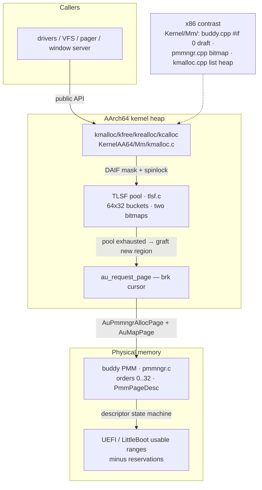

# Memory System Study Guide — TLSF Heap & Buddy Allocator

> **Scope.** This guide covers the **AArch64 memory system end to end**: the
> TLSF kernel heap (`KernelAA64/Mm/tlsf.c`), its wiring layer
> (`KernelAA64/Mm/kmalloc.c`), and the region-aware **buddy physical memory
> manager** (`KernelAA64/Mm/pmmngr.c`) — plus the headers and the host-side
> verification harness. The **x86 counterparts** (`Kernel/Mm/buddy.cpp`,
> `Kernel/Mm/pmmngr.cpp`, `Kernel/Mm/kmalloc.cpp`) are covered as a *contrast
> set*: they show the same problem statements solved differently (and, in the
> case of `buddy.cpp`, solved wrong in instructive ways).
>
> **Companion code.** Every function in those files carries a `// STUDY:`
> block (style: `/* STUDY — … */` above each function). Read this guide *with*
> the code open. Annotations are comment-only — no behavior changes.



**The one-paragraph version.** When kernel code calls `kmalloc(n)`,
`kmalloc.c` masks interrupts, takes a spinlock, and hands `n` to a TLSF
**guaranteed-fit** allocator: free blocks live in a grid of `64 × 32` buckets
tracked by two bitmaps, so a fit needs only bit-scans. If the pool is
exhausted, `au_request_page` maps fresh physical pages above
`KERNEL_BASE_ADDRESS` (a brk) and the new region is grafted in. Physical
pages come from the **buddy**: a power-of-two "orders" allocator over one
48-byte descriptor per physical page, with split-down on allocation and
XOR-merge on free, built out of the bootloader's usable-RAM ranges minus a
reservation set. The x86 tree solves the same problems twice more — once
badly (buddy draft, `#if 0`), once serviceably (bitmap PMM + first-fit
heap) — and the whole AArch64 side is provably sound at boot via a full
`AuPmmngrValidate()` walk plus a self test.

---

## 1. Reading the memory map

| Layer | AArch64 (live) | x86 (contrast) |
|---|---|---|
| Heap contract | `BaseHdr/Mm/kmalloc.h` | same header |
| Heap impl | `tlsf.c` via `kmalloc.c` (O(1), guaranteed fit) | `kmalloc.cpp` first-fit list, or liballoc (`_USE_LIBALLOC`) |
| Virtual growth | brk cursor at `KERNEL_BASE_ADDRESS` | `AuGetFreePage` + map each |
| Physical allocator | `pmmngr.c` region-aware buddy | `pmmngr.cpp` 1-bit-per-page bitmap |
| Buddy draft | — | `buddy.cpp` + `buddy.h`, both `#if 0` |
| Harness | `Tests/tlsf_stress.c` (host-side) | — |

Both kernels share the *contract* headers (`kmalloc.h`, `pmmngr.h`). The
trick in `pmmngr.h` is the **arch split**: `#ifdef ARCH_ARM64` exposes the
buddy API; the `#else` branch exposes the bitmap API and then **macro-shims**
every AArch64-shaped call site (`AuPmmngrAllocPage`, `AuPmmngrAllocPages`,
`AuPmmngrReleasePage`) onto the bitmap functions so shared code compiles on
both sides. Read the shims closely: they *drop* alignment/ceiling/type
arguments and `ReleasePage` expands to `(free, true)` — no refcount, always
"released".

---

## 2. TLSF — the guaranteed-fit heap

### 2.1 What it is, in one line

**Two-Level Segregated Fit**: free memory is sorted into `64 × 32` buckets —
first level = power-of-two **s**ize class (`fl`), second level = 32 equal
sub-slices of that class (`sl`) — and two bitmaps encode exactly which
buckets are non-empty. `malloc`/`free` run in **O(1)** (two bit-scans + one
list operation) with a **guaranteed fit**: the block returned is never worse
than `MIN_BLOCK`-bounded fragmentation away from optimal.

### 2.2 Block geometry (read `tlsf.h` first)

```text
block_header_t (16 bytes)
┌──────────────┬──────────────┐
│ size         │ prev_size    │
│ bit0 = FREE  │ (= size of   │
│ bit1 = PREV  │  the previous│
│ _FREE        │  block)      │
└──────────────┴──────────────┘
       │ free block overflow (32 B min):
       ▼
┌─ hdr ─┬──────────┬──────────┐
│ 16 B  │next_free │prev_free │   ← free-list links LIVE in the payload
└───────┴──────────┴──────────┘
```

- Sizes are **header-inclusive**, stored in `size` with **two stolen flag
  bits** (`BLOCK_FLAG_FREE`, `BLOCK_FLAG_PREV_FREE`) — mask them off with
  `BLOCK_SIZE_MASK`.
- `prev_size` gives **O(1) backward coalescing**: the previous block's start
  is `hdr − prev_size`, no reverse walk.
- Blocks **tile** each region head-to-tail: `next = hdr + size`. A 16-byte
  sentinel at each end of a region stops walks and gives coalescing a real
  `next` to update — **no bounds checks anywhere**.
- Payload is 16-aligned by construction (`hdr` 16-aligned + 16).
- A **free** block overlays its two forward/backward links on its payload —
  which is exactly why freeing something twice (or a smashed filename) turns
  into garbage list pointers. See the *ctrl.exe* story (§4).

### 2.3 The mapping — one size into two coordinates

```c
tlsf_mapping(size, &fl, &sl):
    if (size < 32)          { fl = 0; sl = size; }        /* defensive; heap never maps < 32 */
    else {
        fl = tlsf_fls(size);                              /* highest set bit index */
        sl = (size ^ (1 << fl)) >> (fl - SL_INDEX_COUNT_LOG2); /* next 5 bits below the leading 1 */
    }
```

This is a **round-down** mapping (the bucket that *contains* `size`). Sub-bucket
width at level `fl` is `2^(fl−5)`.

> **Worked example — `size = 2000`:**
>
> ```
> fl  = fls(2000) = 10            (2^10 = 1024 ≤ 2000 < 2048)
> sl  = (2000 ^ 1024) >> 5        (strip the leading bit: 976)
>     = 976 >> 5 = 30
> → bucket (10, 30), covering [1024 + 30·32, +32) = [1984, 2016)   ✔ 2000 ∈ bucket
> ```

Figure: [`figures/tlsf_buckets.png`](figures/tlsf_buckets.png)

### 2.4 The search — how O(1) is possible

`tlsf_find_free_block` needs at most **two** bit-scans and one list pop:

1. **Same `fl`, sub-bucket `sl` and up**: mask
   `sl_bitmap[fl] & ~((1U << sl) − 1)` (bits `sl..31`), `tlsf_ffs` picks the
   smallest non-empty candidate.
2. **Else next `fl` strictly above**: `fl_bitmap & ~((1U << (fl+1)) − 1)`,
   `ffs`, then `ffs` on that class's full `sl_bitmap`. Anything found here is
   `≥ 2^(fl+1)` > every request that mapped into `fl` — **always fits**.

The two bit-scan helpers:

- `tlsf_fls(x)` — find-last-set: index of the highest set bit (`fls(2000)=10`).
- `tlsf_ffs32/64` — find-first-set: index of the lowest set bit, `−1` if `0`.

Both are zero-based (the builtin's 1-based result minus one), so they index
bitmap words directly.

#### ⚠ Hazard you should know (code intentionally unchanged)

Insertion uses this same **round-down** mapping, so a freed block sits in the
bucket *containing* its size. Now suppose a request comes in whose *rounded*
block size is **also** in that bucket but *earlier in it*. Example: payload
1984 → `need = 2000` (with header) vs a freed block of exactly **1984** —
both map to `(10, 30)`. The search returns the 1984-byte block for a 2000-byte
request, `tlsf_malloc`'s split condition (`block_size ≥ size + 32`) fails, and
the whole block is handed out: **16 bytes short** of the request. The deficit
is at most one sub-bucket width `2^(fl−5)` (only possible when `fl ≥ 10`,
i.e. width > 16), and higher `sl` / higher `fl` candidates are safe by
construction.

Reference TLSF solves this with a **second mapping** — `mapping_search()`
rounds the request **up** to the bucket floor before inserting-mapping, so the
found bucket's minimum is always ≥ the request. This port uses one mapping for
both roles and never re-checks `blk_size >= size`. It is a *latent* hazard —
the stress harness can miss it because `verify()` only reads the slot's own
bytes (see `Tests/tlsf_stress.c` STUDY). **Know it, don't "fix" the annotated
code.**

### 2.5 malloc, free, realloc — the three dances

**`tlsf_malloc`** — five moves:

1. **Round the payload up to a header-inclusive block size**
   (`TLSF_ALIGN_UP(size + 16)`, floor 32). Skipping the `+16` was the original
   bug: every block served 16 bytes short and the caller's payload wrote into
   the *next* header.
2. Find a block (§2.4).
3. **Unlink using the block's *own* size mapping**, not the request's. This is
   the "wrong-bucket aliasing" fix (§4) — search may land in a different
   bucket than the block lives in (the `fl+1` fallback), and removing with the
   request's coordinates unlinks *nothing*, handing the same block out twice.
4. **Split** when the tail can hold a whole free block (`≥ 32`): left part =
   the allocation, right = reinserted at *its* mapping; the block after the
   remainder gets its `prev_size | PREV_FREE` repointed. Otherwise keep the
   whole block — fragmentation stays under `MIN_BLOCK` (the guarantee).
5. Account `used_size` (payload only), return `hdr + 16`.

**`tlsf_free`** — mark, then coalesce both ways, then reinsert:

- **Double-free guard first**: a block already `FREE` is ignored outright
  (freeing twice would treat the payload's first 16 bytes — the list links! —
  as a header and unlink garbage).
- Flag `FREE` **preserving `PREV_FREE`** (that bit describes the block
  *behind* this one).
- **Backward**: if predecessor free, unlink it (its own bucket), absorb it,
  and **inherit its `PREV_FREE`** — the flag of the block behind *it*. The
  original code propagated *our* `PREV_FREE` instead, claiming an allocated
  neighbor was free; a later walk unlinked it like a list node → the
  **Namadapha 0x2000 translation fault** (§4).
- **Forward**: unlink the free successor, absorb.
- Tell the block *after* the run (`prev_size = merged`, set `PREV_FREE`),
  insert at the merged size's mapping.

**`tlsf_realloc`** — four exits:

- `ptr == NULL` → malloc. `size == 0` → free + NULL.
- **Shrink**: split the tail off as a free block when leftover ≥ 32 (update
  the block *after* the remainder — its `prev_size` was just rewritten);
  else keep whole.
- **Grow in place**: only if the physical *next* block is free and
  `old + next` covers the need — unlink next (its bucket), split the excess
  back or absorb if `< 32`. Returns the **same pointer** — the common append
  never moves or copies.
- **Grow that can't merge**: malloc fresh, copy `min(old, new)` payloads,
  free old. Pass the *original* payload size into `tlsf_malloc` (it re-adds
  the header), never the header-inclusive `need` — *"learn the hard way"* is
  `--axiss`'s own note on that bug.

### 2.6 The pool object and region grafting

`tlsf_pool_t` is **16,664 bytes of static bookkeeping** (`8 + 64×4 + 64×32×8
+ 16`): the `fl_bitmap`, `sl_bitmap[64]`, `blocks[64][32]`, and the two size
counters. It is statically allocated — the heap cannot allocate its own
control block (circular dependency).

`tlsf_add_memory` turns a raw region into:

```text
[16B sentinel: allocated]  [ ONE huge free block ]  [16B sentinel: allocated]
```

Sentinels are real headers of `size=16`, so walks stop at region edges and
boundary coalescing has a valid `next`. Regions are **independent grafts** —
each grow appends another one, and free-block walks stay within a region by
sentinels. That independence is exactly what lets `kmalloc.c` keep growing the
heap without ever assuming the new pages are adjacent to the old tail (see
the x86 contrast in §6.3, where that assumption *is* made and wrong).

Figure: [`figures/tlsf_block.png`](figures/tlsf_block.png)

---

## 3. The wiring layer — `kmalloc.c`

`kmalloc.c` is thin on purpose: it does **concurrency** and **growth**, and
nothing else.

### 3.1 The lock discipline

```text
save DAIF → mask IRQs → take heap lock → tlsf_* → release lock → restore DAIF
```

The lock alone is *not* enough: a timer tick mid-operation can schedule
another thread (or an IRQ path) that re-enters TLSF while a free-list walk is
in flight — the **ctrl.exe** next_free smash (§4). Masking DAIF keeps the
list surgery atomic on this CPU. Every entry point repeats the pattern:
`kmalloc`, `kfree`, `krealloc`.

### 3.2 Growth outside the lock

When the pool is exhausted, `kmalloc` does **not** grow inside the mask:

```text
unmasked:  au_request_page(32 pages)   ← walks PMM + page tables, SLOW
masked:    tlsf_add_memory(new region) + retry tlsf_malloc
```

The original code grew under the mask; under QEMU/TCG the per-page walking of
`AuPmmngrAllocPage` + `AuMapPage` stalled the **entire system's timer tick**
for milliseconds — visible as system-wide stutter, not a slow alloc. Only the
actual list surgery needs the mask. Same shape in `krealloc`.

### 3.3 `au_request_page` — the brk

```text
_brk_current starts at KERNEL_BASE_ADDRESS
each call: for each page → AuPmmngrAllocPage + AuMapPage at _brk_current++
return old _brk_current
```

Physical pages are individually random (mapped, never assumed contiguous);
virtual addresses are the sequential brk. The heap **never shrinks** — there
is no reverse path (true brk semantics; `au_free_page` exists only for
callers who mapped pages themselves, and the `--axiss` note is candid that
returning fixed-size page groups into the buddy is "not good").

`AuHeapInitialize` does the first graft: **128 pages = 512 KiB**, then the
early spinlock (created with `AuCreateSpinlock(true)` — still kmalloc-free,
because the heap isn't ready yet).

---

## 4. The `--axiss` story shelf

The same file-level notes keep showing up; here they are as folklore:

| Bug | Symptom | Fix |
|---|---|---|
| **Header not in size** | Every allocation 16 bytes short; caller payload skids into the next header | `TLSF_ALIGN_UP(size + TLSF_HEADER_SIZE)` in `tlsf_malloc` |
| **Wrong-bucket unlink** | Search landed elsewhere; removing with the request's mapping unlinks nothing → same block handed out twice | unlink with `mapping(block_size)` — the block's *own* coordinates |
| **`fl` included in fallback** | An empty `sl_bitmap[fl]` high-mask falls back to `fl` itself → a *lower* sub-bucket wins → undersized block | fallback scan starts at `fl+1` (`--axiss` overflow guard) |
| **`prev_prev_free` propagation** | Propagating *our* `PREV_FREE` on backward coalesce claims an allocated neighbor is free; later unlinked as a list node → **Namadapha 0x2000 translation fault** | inherit the *predecessor's* `PREV_FREE` |
| **ctrl.exe** | kfree'd-then-rewritten filename bytes became `next_free`; free-list walk wandered off into ASCII | `tlsf_ptr_sane`: 16-align + TTBR1 range check; corrupt → **drop the bucket**, don't follow |
| **Grow under mask** | Heap growth stalled the timer tick for ms (QEMU/TCG) | grow outside lock/mask; only surgery masked |
| **Double-free** | Second free treats payload (list links) as a header → unlink garbage | `blk_is_free` early return |
| **realloc copy length** | copied a header-inclusive length, over/under-reading | pass original payload size to malloc; copy `min(old_usr, new_usr)` |

Every "fix" here was made by **comment + behavior change** in the repo's own
history; the annotations describe the *current* correct behavior and point at
the scars.

---

## 5. The buddy PMM — `pmmngr.c`

### 5.1 Shape

- **One `PmmPageDesc` per physical page** (48 bytes: `next/prev/owner`,
  `backing_block`, `requested_pages/validation_epoch`, `refcount`,
  `order/state/page_type`).
- Six states: `UNMANAGED` · `RESERVED` · `FREE_HEAD` · `FREE_TAIL` ·
  `ALLOC_HEAD` · `ALLOC_TAIL`.
- Free memory = 33 intrusive lists `free_head[order]` (`order 0..32`,
  block = `2^order` pages), linked *through the head page's descriptor* —
  tails just carry `owner`/`order`.
- Built at boot from `usable[]` (UEFI `type==7` or LittleBoot) **minus**
  `reserved[]`, then proven by `Validate()` + self test.

Figure: [`figures/mem_stack.png`](figures/mem_stack.png)

### 5.2 Range → aligned free blocks (`add_free_range`)

The build step that turns "RAM from A to B" into buddy fodder:

```text
repeat:
    order  = floor_order(last − first)          // biggest 2^order that fits
    while  order && (first & (2^order − 1)): --order   // must be ALIGNED
    emit [first, first+2^order);  first += 2^order
```

Because heads must be `2^order`-aligned (see the XOR rule below), the biggest
fitting block often has to shrink. Worked example — **`[6, 14)`**:

```
gap 8: order 3 fits, but 6 % 8 ≠ 0  → order 2: 6 % 4 ≠ 0 → order 1: 6 % 2 == 0
  emit [6,8) @ order 1
gap 6: order 2: 8 % 4 == 0 → emit [8,12) @ order 2
gap 2: emit [12,14) @ order 1
```

The ragged low-order tail is normal and harmless — later merges rebuild it.

### 5.3 Allocation: `take_block` + `mark_allocated`

`AuPmmngrAllocPages(pages, alignment, ceiling, type)`:

- Guards: `pages ≠ 0`, `alignment` is a power of two, `order_for_pages(pages)
  ≤ 32`. **Orders are ceil-log2**: 17 pages → a 32-page block; waste up to
  ~50% is the buddy's design tax (`requested_pages` keeps the *true* count on
  the head).
- `aorder = order_for_pages(alignment)` turns alignment into another order
  floor (`start = max(wanted, aorder)`).
- **Scan orders upward**, first head whose *end* stays under `ceiling` wins
  (first-fit, not best-fit); `ceiling` is the DMA-safe / low-RAM carve.
- **Split-down** after unlink:
  ```
  while order > wanted:
      order--
      right = head + 2^order      → mark free + insert        (park the right half)
                              head → mark free at order       (keep the left)
  ```
  The left half stays aligned by construction, so the final block is exactly
  a `wanted`-order block with every discarded half parked in its proper list.

### 5.4 Free: `release_block` — the XOR merge

```text
buddy(H, order) = H ^ (1 << order)      // flip the order-th bit

while order < MAX:
    buddy = head ^ (1 << order)
    if buddy invalid / not a FREE_HEAD owned by ITSELF / different order: break
    remove buddy;  head = min(head, buddy);  order++
insert merged block at final order
```

Two pages are buddies at `order` iff their addresses differ exactly in the
`order`-th bit — which is *why* alignment to `2^order` is mandatory
(un-aligned heads couldn't have a computable buddy). The `owner == buddy` +
`state == FREE_HEAD` + same-`order` triple is what prevents fusing a
reserved or allocated block: only true siblings ever combine. Freeing both
halves of a run can rebuild the whole order-8 block — the buddy's
fragmentation **self-heals**.

Figure: [`figures/buddy_orders.png`](figures/buddy_orders.png)

### 5.5 The descriptor state machine around the edges

- **`mark_allocated`** stamps `ALLOC_HEAD` (+ `requested_pages`, `refcount=1`,
  `backing_block=−1`, `page_type`) and `ALLOC_TAIL` pages — a block in these
  states can only return via `release_block`, never through free lists.
- **Refcount protocol**: `RetainPage` only on order-0 `ALLOC_HEAD`
  (cap `UINT16_MAX`); `ReleasePage` decrements and only frees at 0;
  `ReleasePages` refuses wholesale unless *every* member's refcount is 1.
- **Backing block**: per-page disk index for the pager (eviction),
  order-0 heads only.
- **`dsb_ish()`** after the lock drops on release paths: orders *this CPU's*
  descriptor writes so a peer CPU that acquires the lock and takes the page
  sees a fully-updated descriptor — the cross-core visibility guarantee.
- **`P2V/V2P`/`AuPmmngrMoveHigher`**: identity until the direct map is up,
  then `direct_map_base + phys`; `page_desc` re-anchored at its direct-mapped
  address. (x86: identical shape, driven by `_HigherHalf`.)

### 5.6 Metadata placement and boot

- `total_pages = ceil(highest / 4K)`; descriptors = `total_pages × 48 B`.
  For 4 GiB RAM: 1,048,576 × 48 = **48 MiB** of metadata.
- `find_metadata` first-fits a gap in usable-minus-reserved and *reserves it*
  (the descriptor array is never allocatable). Footprint and placement are
  printed at boot.
- Boot paths: **UEFI** (`type ≤ 7 → highest`; `type == 7 → usable`);
  **LittleBoot** (pre-classified usable + explicit reservations: low 1 MiB,
  DT blob, initrd, LittleBoot itself).
- Reservations added at init: low 1 MiB + each boot-stack page pushed on the
  loader's `allocated_stack` (pre-PMM debug output), then normalized.
- **`recount()`** brute-forces stats from states; **`Validate()`** (epoch
  stamped) checks every free list (alignment! ownership! order! in-bounds!
  no double-listing!) and every descriptor (head/tail consistency, refcount/
  requested sanity) and cross-checks against the running `pmm_stats`.
- **`boot_self_test`** (skipped on `__XENEVA_BLEED__` — deep stack, tied to
  the xnldr story): 384 unique order-0 pages, refcount retain/release, six
  compound runs (incl. 17 pages → 32-block and a 64-page-aligned 256), then
  stats must `memcmp` equal *before vs after* plus full validation — the
  allocator must return to exactly its pre-test state.

### 5.7 The stress harness — `Tests/tlsf_stress.c`

Host-side, same `tlsf.c` via include path; `puts` as the only libc.

- 2 MiB static 16-aligned arena → ONE grafted region; 256 slots; **50,000**
  iterations; sizes 1..12288 (same `fl` classes churn hard: split/coalesce/
  fallback all hit thousands of times).
- xorshift32 PRNG, seed `0x58454e45` = little-endian **"XENE"** — deterministic,
  failures replay.
- Exit codes localize the failure stage: `1` add refused, `2` live-slot
  corruption, `3` realloc lost data, `4` final-sweep corruption.
- **Caveat the annotations call out**: `verify()` reads only the slot's own
  bytes, so a too-small block whose overflow lands in a *neighbor's header*
  is only caught when that neighbor is verified or freed.

---

## 6. The x86 contrast set (read these with the AA64 side open)

### 6.1 `buddy.cpp` — the draft you'd learn more from than from a textbook

Both file and header are `#if 0` — nothing compiles, **by design**. Its shape
is a real buddy (levels 0..6 from 4 KiB down to 64 B, `GetRoundOffNum`,
split-on-alloc) and its *defects are grade-A teaching material*:

1. **Merge identity**: `mergeable_blk = MAX(list_head, blk)` picks the
   higher-address block — that is **not** the buddy (`head ^ (1<<order)` is).
   Any two unrelated blocks can fuse; used memory gets swallowed.
2. **`RemoveFreeListHead()` called twice** arbitrarily — pops two nodes
   even when neither is the sibling; two live free blocks vanish.
3. **Recursive re-merge** re-derives the level from the *doubled* size and
   fuses again with whatever occupies the imaginary level — climbing toward
   level 0, where it inserts an oversized fiction.
4. **The OOB**: `GetLevel` returns up to **6** (64-byte blocks) but
   `__BuddyFreeList` is `[MAX_LEVELS−1] = [6]` → index 6 writes outside the
   array.
5. **No graft primitive**: the buddy can only manage pages its *own*
   `au_request_page` calls donate — most RAM is unreachable.
6. Level-0 free with an empty list *silently skips* the merge.

Compare each line to `pmmngr.c`'s `release_block`: XOR, `owner==buddy`
validation, ordering, single final insert, no recursion, no OOB.

### 6.2 `pmmngr.cpp` — the bitmap PMM

- 1 bit per 4K page, MSB-first math: `byte = index/8`, bit = `0x80 >> (index%8)`.
- **The cursor**: `_RamBitmapIndex` scans forward; **every free rewinds it** —
  a locality heuristic so churn reuses low pages instead of ratcheting up.
- Init: bitmap area = first type-7, >1 MiB, 4K-aligned, cacheable region…
  and then `BitmapSize = TotalRam/8` is passed to `AuPmmngrLockPages` as a
  *page count* — **~1/8 of ALL RAM permanently locked** "as bitmap area"
  (the bitmap itself is only that many *bytes*). A spectacular but
  representative over-reservation; the AA64 buddy reserves exactly
  `total_pages × 48`.
- `AllocBlocks` = `num` separate `AuPmmngrAlloc`s + returning the first:
  **no contiguity, no record of the interior pages** (in C this is the
  *real* reason the ARM64 shims can't promise runs).
- Exhaustion → `cli` + infinite spin ("Kernel Panic!!! No more physical
  memory") — no NULL contract.
- No lock, no ownership stamps, double-free is silently idempotent-ish.

### 6.3 `kmalloc.cpp` — the first-fit list heap

Two bodies behind one API: **liballoc** (`port_*`, MSVC `_USE_LIBALLOC`) or
the **hand-rolled list allocator**. The list allocator is O(n) per alloc,
unlocked, and carrying a small anthology of defects:

- **Dead floor**: `if (size < 24) size = 24;` is immediately overwritten by
  `size = align24(sz)` built from the *original* `sz` (and `align24` actually
  aligns to **8**).
- **`merge_next` precedence slip**: `if (!meta->next->magic == MAGIC_FREE)`
  parses as `(!magic) == MAGIC_FREE` — with `MAGIC_FREE` nonzero, the guard
  effectively **never fires**, so merge_next fuses a block that may still be
  ALLOCATED → aliasing a live allocation into the free block.
- **`merge_prev` tail spin**: when the merged block IS `last_block`, the path
  prints, updates `last_mark`, then hits `for(;;);` — a deliberate
  infinite spin. Any kfree that lands exactly on the last block of the heap
  **wedges the system**.
- Pointer-arithmetic slips in both merges' `last_mark` updates
  (`last_block + last_block->size` in `meta_data_t*` arithmetic = size ×
  sizeof, not size bytes).
- **`krealloc` over-reads**: copies `new_size` bytes from the old block
  (should be `min(old,new)`), and no `result == NULL` check before memcpy.
- **Adjacency assumption in `au_expand_kmalloc`**: grows `au_request_page`
  ranges that `AuGetFreePage` does not guarantee contiguous with the old
  tail — the "merged" block can silently span a **virtual gap** (the AA64
  TLSF graft model has no such assumption).

Every one of these disappears structurally in the TLSF + descriptor design —
that is the single biggest takeaway of this section.

---

## 7. Quiz yourself

**TLSF blocks**

1. How many bytes is a block header? What two flag bits live in `size`?
2. Why is `prev_size` on the header at all?
3. Compute `(fl, sl)` for `size = 4000` and name the bucket's byte range.
4. What is the sub-bucket width at `fl = 12`?
5. The search mask `~((1U << sl) - 1)` — what does it select, and why does the
   fallback start at `fl+1` and not `fl`?
6. In the same-sub-bucket hazard: why can a returned block still be smaller
   than the request, and how does reference TLSF prevent it?
7. Why must `tlsf_remove_free_block` use the block's own size mapping, not
   the request's?
8. When split leaves a remainder: whose `prev_size`/`PREV_FREE` changes, and
   why did the version that touched the remainder itself break?
9. What protects the free lists from a freed-then-overwritten payload? What
   does the allocator do instead of following the bad pointers?
10. Why is the pool object `static`?
11. A region of 3000 bytes is grafted: how many sentinels, where, and what if
    the region is 400 bytes? (min-block math)
12. In realloc's in-place grow: what precondition gates it, and what does it
    do with the excess beyond the new size?

**Buddy PMM blocks**

13. Enumerate the six `PmmPageState` values and what each means.
14. Why must a `2^order` block's head be `2^order`-aligned? (Derive from the
    XOR buddy rule.)
15. Decompose `[5, 13)` into aligned free blocks (show the order-1/order-2
    dance).
16. `order_for_pages(17)` = ? `floor_order(17)` = ? Which is used where, and
    what does `requested_pages` record?
17. Walk `take_block` splitting an order-3 block down to order 1 — which
    halves get parked and which is returned?
18. `release_block(head=8, order=0)` — name the candidates checked at each
    merge step (8^1, then?).
19. `AuPmmngrReleasePages`: what single condition can refuse the whole
    release?
20. What does the `dsb_ish()` after unlock actually order, and who is the
    consumer?
21. Where does the descriptor array itself live, and how is it protected?
    (4 GiB RAM → how many MB of metadata?)
22. What does `validation_epoch` prevent, and how does it handle wrap-around?
23. List every invariant `AuPmmngrValidate` checks on a FREE_HEAD.
24. The boot self test frees even singles, then runs, then odd singles — why
    that order?
25. What Boolean completes the check: `listed == free` AND
    `free+allocated+reserved == managed` AND …?
26. What is `__XENEVA_BLEED__` skipping and why (tie to the xnldr story)?

**Wiring / contrast blocks**

27. `kmalloc` grows the pool outside the DAIF mask — what exactly would the
    masked grow break, and why is only the surgery masked?
28. Does the x86 `merge_next` guard fire as written? (Operator precedence.)
29. `merge_prev` can hang — where? (and why the AA64 TLSF cannot.)
30. `AuPmmngrAllocBlocks(3)` — is it 3 contiguous pages? What does the ARM64
    shim in `pmmngr.h` *not* translate?
31. Why is the 1/8-of-RAM "bitmap area" reservation in x86 pmmngr init both
    wrong and hidden?
32. The stress harness: what does `verify` *not* catch, and why is that the
    same blind spot as the same-sub-bucket hazard?

---

## 8. Suggested reading order, with the code

1. `BaseHdr/Mm/tlsf.h` and `KernelAA64/Mm/tlsf.c` — the whole TLSF, in
   annotation order (§2).
2. `Tests/tlsf_stress.c` — the contract you want to satisfy (§5.7).
3. `KernelAA64/Mm/kmalloc.c` — the lock/grow layer (§3).
4. `BaseHdr/Mm/pmmngr.h` + `KernelAA64/Mm/pmmngr.c` — the buddy (§5).
5. Contrast trio: `Kernel/Mm/buddy.cpp` → `pmmngr.cpp` → `kmalloc.cpp`
   (§6): read each merged/free path side-by-side with its AA64 twin and
   reconcile the x86 defects with the AA64 guarantees.
6. Re-run the self-checks mentally via §7, then re-run `boot_self_test`'s
   order-0/refcount/compound/restore script by hand on a sheet of paper.