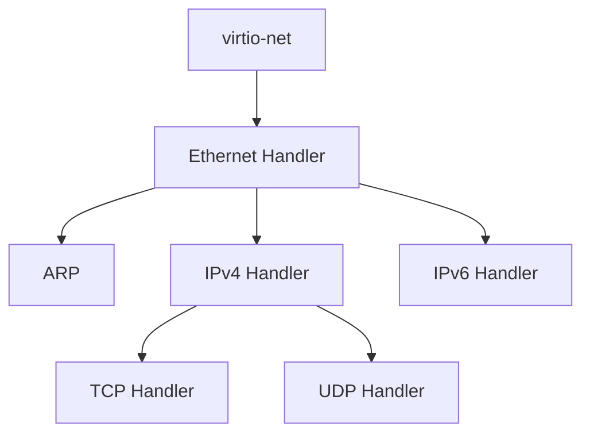
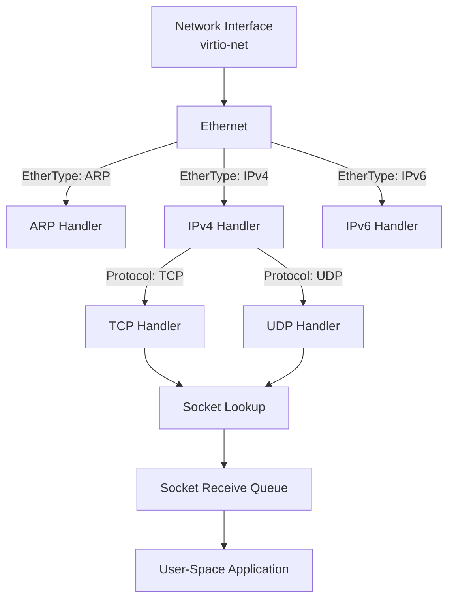

# Networking in XenevaOS
XenevaOS provides a layered networking architecture that enables user-space applications to communicate with the network through a socket-based interface. The networking stack is implemented in the kernel and processes packets sequentially through different protocol layers, with each layer responsible for handling a specific type of network protocol.

When a packet is received from a network interface, the kernel examines its metadata to determine which protocol handler should process it next. For example, an Ethernet frame received from the network interface is first inspected to determine its ``EtherType``. Based on this value, the packet can be dispatched to the appropriate protocol handler, such as ARP, IPv4, IPv6, or another Ethernet-based protocol.

This approach allows each networking layer to remain independent while providing a clear path for packets throough the networking stack. For example, an Ethernet frame containing an IPv4 packet is passed from the Ethernet layer to the IPv4 handler, which can then inspect the IP protocol field and forward the packet to the appropriate transport-layer protocol such as TCP or UDP.

In XenevaOS, this packet-dispatch mechanism is implemented using protocol-specific handlers. A simplified example is shown below.

```C
switch(ntohs(frame->typeLen)){
    case ETHERNET_TYPE_ARP:
        ARPHandlePacket((void*)&frame->payload, nic);
        break;
    case ETHERNET_TYPE_IPV4:
        IPv4HandlePacket((void*)&frame->payload, nic);
        break;
    case ETHERNET_TYPE_IPV6:
       // IPv6HandlePacket((void*)&frame->payload, nic);
        break;
}
```

Each network protocol implemented in the XenevaOS kernel should provide a common handler interface. This interface allows the networking subsystem to pass packets between different protocol layers in a consistent manner.

A protocol handler can be represented by a function such as:

```C
void YourProtocolHandler(IPv4Header* ipv4, AuVFSNode* nic);
```
The protocol handler acts as a packet parser and processor. It is invoked by the appropriate upstream protocol handler after the packet type has been indentified. 

For example, consider a ``virtio-net`` network interface. The ``virtio-net`` driver receives Ethernet frames from the network and passes them to the top-level Ethernet packet handler. The Ethernet handler examines the ``EtherType`` and determines which protocol should process the packet next.

The packet flow can therefore be represented as:


When an IPv4 packet is received, the IPv4 handler parses the IPv4 header and examines the protocol field. Based ont his field, the packet is dispatched to the appropriate transport-layer protocol, such as TCP or UDP

### Packet Queues

Transport-layer protocols such as TCP and UDP are responsible for delivering received packets to the appropriate socket. When a packet reches one of these protocols, the destination port number is used to determine which socket should receive the packet.

Each socket maintains a dedicated packet queue. When a packet arrives, the protocol handler checks whether a socket is associated with the destination port. If a matching socket exists, the packet is placed into that socket's receive queue.

A simplified packet flow is:



These socket-associated packet queues are created and managed through the socket API exposed to user space. This allows applications to receive network data without directly interacting with the underlying network drivers or protocol implementations.

This design keeps the networking stack modular: network drivers are responsible for receiving frames, protocol handlers are responsible for parsing and dispatching packets, and sockets provide the interface through which user-space applications consume network data.

## Standard Socket requirement

The transport-layer protocol is responsible for implementing the operations required by the socket interface. XenevaOS defines a common set of socket operations, allowing different transport protocols to provide their own implementations while maintaining a consistent interface for user-space applications.

For example, TCP is a connection-oriented protocol and therefore requires an implementation of the ``connect()`` operation. UDP, on the other hand, is connectionless and does not require ``connect()`` to eastablish a connection.

A protocol can provide implementations for the socket operations through function pointers:

```C
int (*receive)(struct _socket_* sock, msghdr *msg, int flags);
int (*send)(struct _socket_* sock, msghdr* msg, int flags);
void (*close)(struct _socket_* sock);
int (*connect)(struct _socket_* sock, sockaddr* addr, socklen_t addrlen);
int (*bind)(struct _socket_* sock, sockaddr* addr, socklen_t addrlen);
```

When the ``socket()`` system call is invoked, the kernel determines which protocol should handle the requested socket based on the socket parameters, such as the address family, socket type, and protocol. The selected protocol then creates and initialize the corresponding socket structure.

For example, a protocol could initiailze a socket as follows:

```C
int CreateDummyProtocolSocket() {
	AuSocket* sock = (AuSocket*)kmalloc(sizeof(AuSocket));
	memset(sock, 0, sizeof(AuSocket));
	sock->send = AuDummySend;
	sock->receive = AuDummyReceive;
	sock->connect = AuDummyConnect;
	sock->bind = AuDummyBind;
	sock->close = AuDummyClose;
	sock->rxstack = AuStackCreate();
	fd = AuProcessGetFileDesc(proc);
	AuVFSNode* node = (AuVFSNode*)kmalloc(sizeof(AuVFSNode));
	memset(node, 0, sizeof(AuVFSNode));
	node->flags |= FS_FLAG_SOCKET;
	node->device = sock;
	node->close = AuDummyFileClose;
	node->iocontrol = SocketIOControl;
	proc->fds[fd] = node;
	return fd;
}
```

Here, each function pointer connects a standard socket operation to the implementation provided by the protocol. This allows the core socket subsystem to remain protocol-independent while TCP, UDP, or other transport protocols implement their own networking semantics.

Coneceptually, the relationship can be represented as:

```mermaid
flowchart TD
A[User-Space Application] --> B[socket syscall]
B --> C[Socket subsystem] 
C -->|Select protocol| D[Transport Protocol]
D --> E[TCP]
D --> F[UDP]
E --> G[Protocol-specific socket operation]
F --> G
````

Each transport protocol maintains its own list of active sockets. When a socket is created through the socket interface, it is registered with the corresponding protocol and can be assigned a dedicated port number.

The port associated with a socket is stored in the ``sessionPort` field of the socket structure. This allows the transport protocol to identify the socket that should receive an incoming packet on its destination port.

In XenevaOS, both TCP and UDP use the ``obtainPort()`` function to allocate a port and register the socket with the protocol's socket list. The networking stack also supports explicitly specifying a port rather than relying entirely on aurtomatic port allocation.

Here's the representation of the socket structure:

```C
typedef struct _socket_ {
	void* binedDev;
	AuStack *rxstack;
	uint16_t sessionPort;
	uint8_t sockState;
	unsigned packID;
	uint16_t ipv4Iden;
	int (*receive)(struct _socket_* sock, msghdr *msg, int flags);
	int (*send)(struct _socket_* sock, msghdr* msg, int flags);
	void (*close)(struct _socket_* sock);
	int (*connect)(struct _socket_* sock, sockaddr* addr, socklen_t addrlen);
	int (*bind)(struct _socket_* sock, sockaddr* addr, socklen_t addrlen);
} AuSocket;
```

| Field name | Description |
|------------|-------------|
| ``bindedDev``| This field is a pointer to nic device file, that is attached after successfull binding call
| ``rxstack`` | Stack data structure used by dedicated protocol to queue received packet for user space. User space can dequeue packet from here.
| ``sessionPort``| Port number of this running network session 
| ``sockState`` | Current status of the socket, 1 - ``SOCK_STATE_WAITING_FOR_CONNECTION`` and 0 - ``SOCK_STATE_CONNECTION_RST`` 
| ``packID`` | Used by protocol 
| ``ipv4Iden`` | IPv4 specific field
| ``receive`` | Pointer to receive function within the protocol
| ``send`` | Pointer to send function within the protocol
| ``close`` | Pointer to close function within the protocol
| ``connect``| Pointer to connect function within the protocol
| ``bind`` | Pointer to bind function within the protocol


